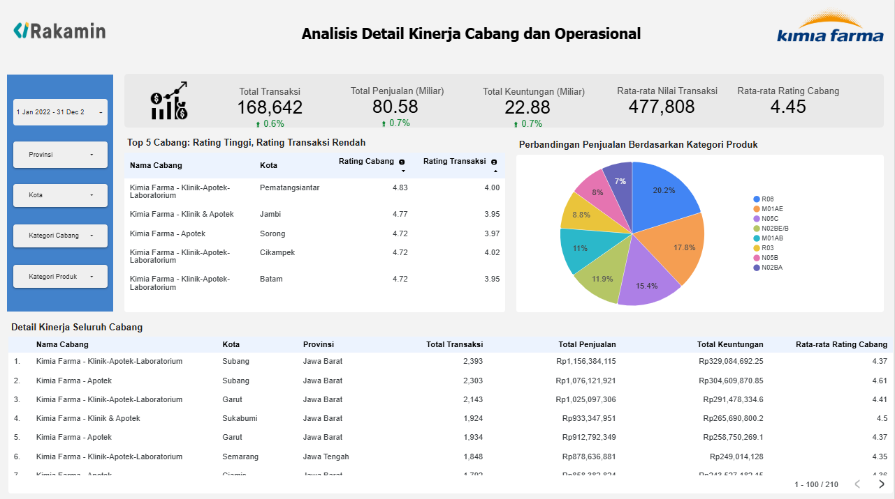

# Analisis Kinerja Bisnis Kimia Farma (2020-2023)

## 📝 Tentang Proyek

Proyek ini merupakan analisis mendalam terhadap data transaksi Kimia Farma selama empat tahun (2020-2023). Tujuannya adalah untuk mengidentifikasi tren kinerja, menemukan insight operasional, dan memberikan rekomendasi strategis berbasis data untuk mendorong pertumbuhan bisnis.

---

## 🛠️ Tools yang Digunakan

*   **Google BigQuery:** Untuk penyimpanan data (data warehousing) dan transformasi data menggunakan SQL.
*   **Google Looker Studio:** Untuk membuat dasbor interaktif dan visualisasi data.
*   **Git & GitHub:** Untuk kontrol versi dan manajemen proyek.

---

## 📂 Struktur Proyek

*   `/data`: Berisi dataset mentah dalam format CSV.
*   `/sql`: Berisi query SQL yang digunakan untuk membersihkan, menggabungkan, dan membuat tabel analisis akhir di BigQuery.
*   `/dashboard`: Berisi screenshot dari dasbor final.

---

## 📈 Alur Kerja Analisis

1.  **Data Loading:** Dataset mentah diimpor ke dalam Google BigQuery.
2.  **Data Transformation (SQL):** Sebuah query SQL tunggal (menggunakan CTE untuk keterbacaan) dijalankan untuk menggabungkan empat tabel sumber, menghitung metrik turunan seperti `nett_sales` dan `nett_profit`, dan menghasilkan satu tabel analisis utama yang bersih.
3.  **Data Visualization:** Tabel analisis dihubungkan ke Looker Studio untuk membangun dasbor interaktif yang terdiri dari dua halaman utama: Executive Overview dan Analisis Detail Cabang.

---

## 📊 Dashboard Showcase

### [➡️ Klik di sini untuk melihat Dasbor Interaktif Langsung][(https://lookerstudio.google.com/reporting/ef4db08b-55c7-4992-aff0-855f9c79e60b)]

### Halaman 1: Executive Overview

### Halaman 2: Analisis Detail Kinerja Cabang

---

## 💡 Temuan Kunci & Rekomendasi

1.  **Stagnasi Pertumbuhan:** Tren pendapatan cenderung datar selama periode 4 tahun.
    *   **Rekomendasi:** Merumuskan strategi ekspansi pasar baru atau diversifikasi produk untuk memecah siklus stagnasi.

2.  **Ketergantungan Regional:** Kinerja sangat terkonsentrasi di Jawa Barat.
    *   **Rekomendasi:** Melakukan analisis pasar di provinsi potensial lain untuk mengurangi risiko dan mencari sumber pertumbuhan baru.

3.  **Anomali Efisiensi Operasional:** Ditemukan 5 cabang dengan rating umum yang tinggi namun rating transaksi yang rendah, mengindikasikan adanya masalah pada proses pembayaran/kasir.
    *   **Rekomendasi:** Melakukan audit operasional pada cabang-cabang ini sebagai perbaikan cepat (*low-hanging fruit*) untuk meningkatkan kepuasan pelanggan.

---

## 📞 Kontak

Anastasia Mia Martalia 
anastasiamiamartalia@gmail.com 
https://www.linkedin.com/in/anastasia-mia-martalia/
